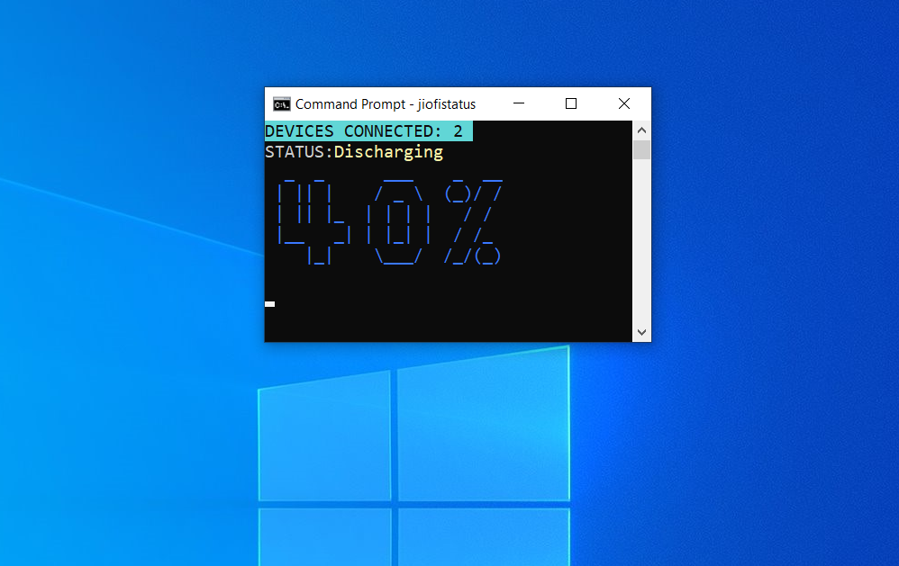

# jiofistatus
Node.js app to display JioFi 4 router's battery level, charging status & total devices connected, updated continuously.

*Sharing a JioFi router with friends or family ?, afraid if the router goes off due to low battery or too many devices connected ?, this tool should be handy. Avoid checking the router manually or visiting the jiofi.local.html page continously.* 

Source code can be quickly modified to actually send desktop notification when battery goes low.

*Likely to work with other JioFi Router models as well.*

Here is a screenshot of how it looks like, when it's fully charged & 3 devices connected,


## Usage
### Installation
Make sure you have Node.js & npm installed.

```bash
npm i -g jiofistatus
```

### Running
Open command prompt anywhere & execute

```bash
jiofistatus
```
Will display the name & version before showing the status as shown in screenshot above.

**Windows users can automate the start of the application on windows startup by using the bat file included in "windows" directory.** Follow the "Run batch files on startup" (last part) of [this article](https://www.windowscentral.com/how-create-and-run-batch-file-windows-10).

## For Development

clone or fork the repository.
After navigating to the project directory,
first, install the dependencies.
```bash
npm install
```

Run using
```bash
node .
``` 
or 
```bash
node index.js
```

To run globally,
```bash
npm link
```
& then typing "jiofistatus" in cmd anywhere should work.

## Colour Convention

Even if battery level percentage is shown, the best & effective way to know the battery level is colour.

Those who are familiar with JioFi router (JioFi 4), are aware that it displays three different colours for battery level: green, blue & red. The same convention is used.

* Battery level (%) gets displayed in green if level >=50%
* Battery level (%) gets displayed in blue if level >=20% (& <50%)
* Battery level (%) gets be displayed in red if level <20%
* Battery status (charging or discharging) will be green if charging or fully charged.
* Battery status will be yellow if discharging.
* Number of devices connected gets displayed in a fixed colour as shown in screenshots.

**Tip: Charge you JioFi if you see large blue or red, instead of green.**

Here are some more screenshots for reference.





## Notes

* The status is updated every minute (60 seconds) if connected to a JioFi. In case of error or if not connected to a JioFi, retries every 10 seconds.
* **If the number of devices connected is shown as 0, this is not an application bug but related to JioFi router (or jiofi.local.html page).** It shows 0 if devices are connected to the router but there is "No Internet". You can verify by browsing some content to check internet access or disconnect & reconnect once.
* If connected devices shown is 0, as explained above, it may take up to 1 minute to display the updated value. It is already mentioned that app gets updated every minute.

## Credits
Thanks to these awesome libraries,

[cheerio](https://www.npmjs.com/package/cheerio) Fast, flexible & lean implementation of core jQuery designed specifically for the server.

[request](https://www.npmjs.com/package/request) Request is designed to be the simplest way possible to make http calls.

[chalk](https://www.npmjs.com/package/chalk) Terminal string styling done right

[figlet](https://www.npmjs.com/package/figlet) FIGfont (battery level is displayed using this)


## License
MIT

(c) 2020, Rupjyoti Nath

Check the LICENSE file. 

Note: 3rd party packages/libraries have their own Licenses.